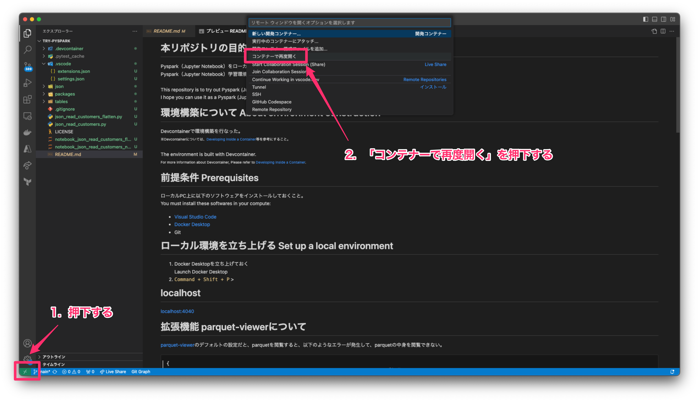
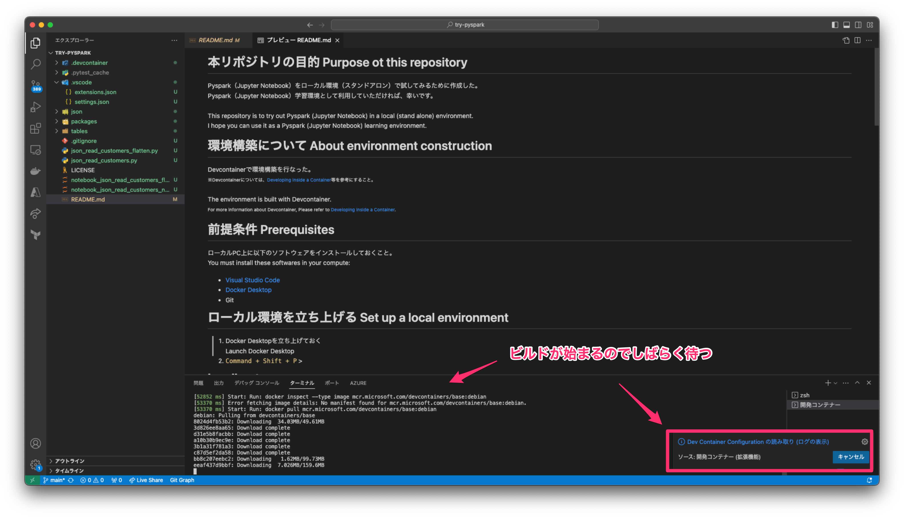
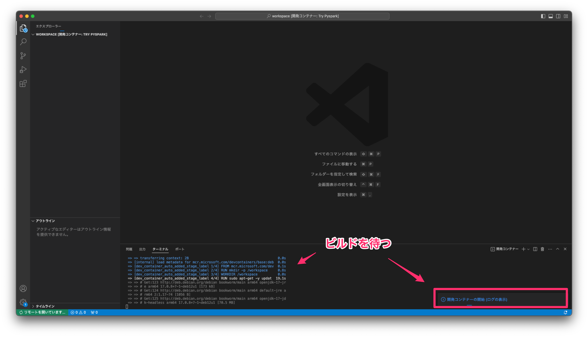
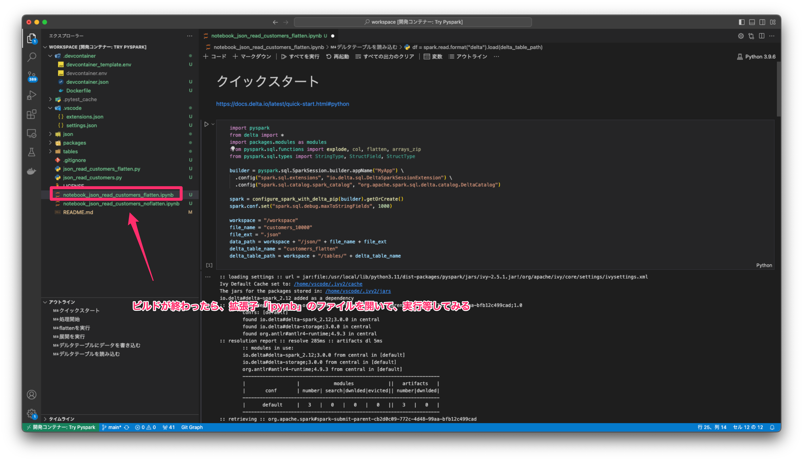
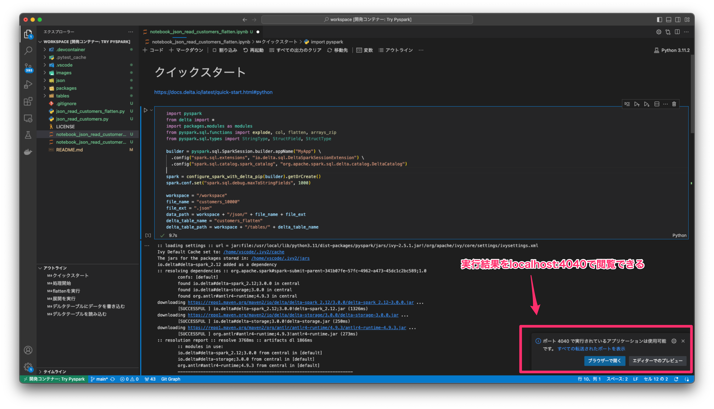
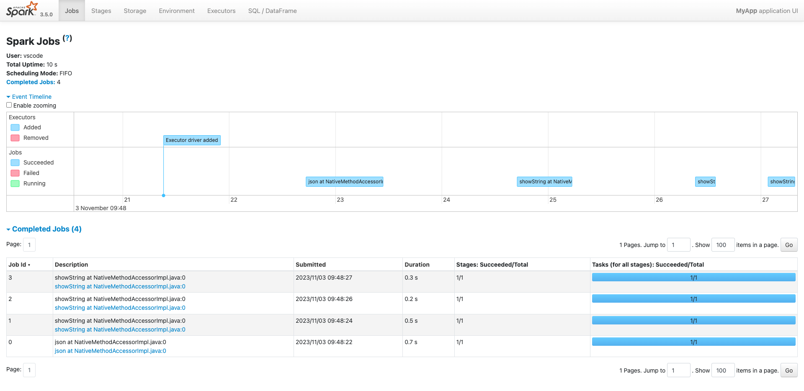
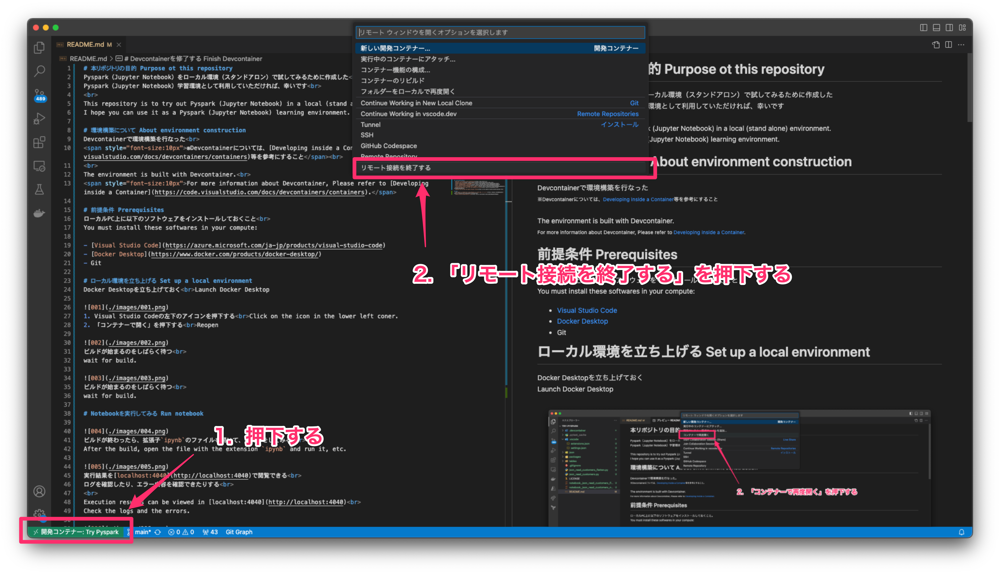

# 本リポジトリの目的 Purpose ot this repository
Pyspark（Jupyter Notebook）をローカル環境（スタンドアロン）で試してみるために作成した<br>
Pyspark（Jupyter Notebook）学習環境として利用していただければ、幸いです<br>
<br>
This repository is to try out Pyspark (Jupyter Notebook) in a local (stand alone) environment.<br>
I hope you can use it as a Pyspark (Jupyter Notebook) learning environment.

# 実行イメージ
## Visual Studio Codeでの実行イメージ


## localhost上での結果出力イメージ
[localhost:4040](http://localhost:4040)


# 環境構築について About environment construction
Devcontainerで環境構築を行なった<br>
<span style="font-size:10px">※Devcontainerについては、[Developing inside a Container](https://code.visualstudio.com/docs/devcontainers/containers)等を参考にすること</span><br>
<br>
The environment is built with Devcontainer.<br>
<span style="font-size:10px">For more information about Devcontainer, Please refer to [Developing inside a Container](https://code.visualstudio.com/docs/devcontainers/containers).</span>

## 前提条件 Prerequisites
ローカルPC上に以下のソフトウェアをインストールしておくこと<br>
You must install these softwares in your compute:

- [Visual Studio Code](https://azure.microsoft.com/ja-jp/products/visual-studio-code)
- [Docker Desktop](https://www.docker.com/products/docker-desktop/)
- Git

また、Visual Studio Codeに以下の拡張機能をインストールしておくこと<br>
Also, the following extensions should be installed in Visual Studio Code

- [Dev Containers](https://marketplace.visualstudio.com/items?itemName=ms-vscode-remote.remote-containers)

## 事前準備 Preparetion
`Apache Spark`はJavaで動いている<br>
なので、Javaのインストール後、環境変数`JAVA_HOME`を設定する必要がある<br>
`.devcontainer/devcontainer.env`を用意し、そこに以下の記述をする必要がある<br>
既存ファイル`.devcontainer/devcontainer_template.env`を利用すると良い<br>
執筆時点では、以下である<br>
<br>
`Apache Spark` runs in Java.<br>
Therefore, it is necessary to set the environment variable `JAVA_HOME` after installing Java.<br>
Prepare `.devcontainer/devcontainer.env`, and it is necessary to describe the following in it.<br>
You can use the existing file `.devcontainer/devcontainer_template.env`<br>
At the time of writing, it is as follows:

```
JAVA_HOME=/usr/lib/jvm/java-17-openjdk-arm64
```

`Apache Spark`が動かない時は、この設定を見直す<br>
調べ方は以下<br>
If `Apache Spark` doesn't work, edit this setting<br>
Here is how to find out.<br>

```
sudo update-alternatives --config java

There is 1 choice for the alternative java (providing /usr/bin/java).

  Selection    Path                                         Priority   Status
------------------------------------------------------------
* 0            /usr/lib/jvm/java-17-openjdk-amd64/bin/java   1711      auto mode
  1            /usr/lib/jvm/java-17-openjdk-amd64/bin/java   1711      manual mode

Press <enter> to keep the current choice[*], or type selection number: 
```

## ローカル環境を立ち上げる Set up a local environment
Docker Desktopを立ち上げておく<br>Launch Docker Desktop


1. Visual Studio Codeの左下のアイコンを押下する<br>Click on the icon in the lower left coner.
2. 「コンテナーで開く」を押下する<br>Reopen in Container


ビルドが始まるのをしばらく待つ<br>
wait for build.


ビルドが始まるのをしばらく待つ<br>
wait for build.

## Notebookを実行してみる Run notebook


ビルドが終わったら、拡張子`ipynb`のファイルを開いて、実行等をしてみる<br>
After the build, open the file with the extension `ipynb` and run it, etc.


実行結果を[localhost:4040](http://localhost:4040)で閲覧できる<br>
ログを確認したり、エラー内容を確認できたりする<br>
<br>
Execution results can be viewed in [localhost:4040](http://localhost:4040)<br>
Check the logs and the errors.



## Devcontainerを終了する Finish Devcontainer


1. Visual Studio Codeの左下のアイコンを押下する<br>Click on the icon in the lower left coner.
2. 「リモート接続を終了する」を押下する<br>Close Remote connection

# 注意事項
## テストデータについて
[./json](./json/)配下にあるデータはテストデータで[Faker](https://fakerjs.dev/guide/)で作成したもので、人物の情報は全て架空である<br>
<br>
The data under the directory [./json](./json/) is test data created by [Faker](https://fakerjs.dev/guide/), and all the person information is fictitious.

## java.lang.OutOfMemoryError: Java heap spaceについて
テストデータの容量が大きすぎると`java.lang.OutOfMemoryError: Java heap space`で処理が止まる<br>
あくまでも検証用の環境なので、あまり大量のデータで処理をさせないように注意すること<br>
<br>
Processing stops with error `java.lang.OutOfMemoryError: Java heap space`, when test data size is too huge.<br>
Be careful not to process too huge data since this is only a verification environment.

---

# 参考情報
## デルタテーブルに書き込めない場合の対処法
- [Koalas / pyspark Failed to find data source: delta](https://stackoverflow.com/questions/69048059/koalas-pyspark-failed-to-find-data-source-delta)

## JAVA_HOMEを環境変数に設定する
- [Ubuntu 20.04にAptを使用してJavaをインストールする方法](https://www.digitalocean.com/community/tutorials/how-to-install-java-with-apt-on-ubuntu-20-04-ja#java_home)
- [apt-getでJavaをインストールしよう(Ubuntu)](https://www.linuxmania.jp/apt-install-java.html#environment_javahome)

## jsonをflattenする
- [Azure Synapse Analytics で複合データ型を分析する](https://learn.microsoft.com/ja-jp/azure/synapse-analytics/how-to-analyze-complex-schema)

## その他の役立つTips
- [Welcome to the Delta Lake documentation](https://docs.delta.io/)
- [Pyspark Overview](https://spark.apache.org/docs/latest/api/python/index.html)
- [PySparkのDataFrameをSparkSQLで操作する](https://blog.amedama.jp/entry/2018/03/03/173257)
- [Delta Lakeクイックスタートガイド](https://qiita.com/taka_yayoi/items/345f503d5f8177084f24)
- [Delta Lakeのベストプラクティス](https://qiita.com/taka_yayoi/items/472c85fba31aa2c50762)
- [.devcontainer.jsonの設定をいつも忘れるのでメモ](https://qiita.com/quotto/items/a672e8b3b45865832577)
- [Databricks(Spark)の Spark SQL にて変数を利用する方法](https://qiita.com/manabian/items/a7f03e047d82259df313)
- [Reading and Writing the Apache Parquet Format](https://arrow.apache.org/docs/python/parquet.html)

## Data
- [Why Upsert in Databricks using Pyspark is a bad idea, or is it ?](https://medium.com/@debayankar/upsert-in-databricks-using-pyspark-d1cf1bef7254)
- [Apache SparkのTempViewに嵌った話](https://qiita.com/nanndot/items/d168c98da835b740dd4d)


---

# 拡張機能 parquet-viewerについて
[parquet-viewer](https://marketplace.visualstudio.com/items?itemName=dvirtz.parquet-viewer)のデフォルトの設定だと、parquetを閲覧するときに、以下のようなエラーが発生して、parquetを閲覧できないので要注意<br>
<br>
Note that with the default configuration of [parquet-viewer](https://marketplace.visualstudio.com/items?itemName=dvirtz.parquet-viewer), the following error occurs when viewing parquet, and parquet cannot be viewed.

```json
{
  "error": "while reading /workspace/tables/customers_flatten/address_state=愛知県/part-00000-a330616d-9cc0-493a-ac8f-d3d1bed5663d.c000.snappy.parquet: Error: cannot find prebuilt arrow module, either build the module or use another backend: Error: Failed to find binding for arrow-parquet-reader"
}
```

故に、`.vscode/settings.json`の設定内容を以下のように変更している<br>
<br>
Therefore, the settings in `.vscode/settings.json` are changed as follows:

```json
# before
{
  "parquet-viewer.backend": "arrow"
}

# after
{
  "parquet-viewer.backend": "parquets"
}
```